# Kubernetes pro dinosaury

Jan Tomášek
<jan@tomasek.cz>
&nbsp;

Linux Days 2025

https://tomasek.cz/ld25

&nbsp;
&nbsp;
&nbsp;
&nbsp;
&nbsp;

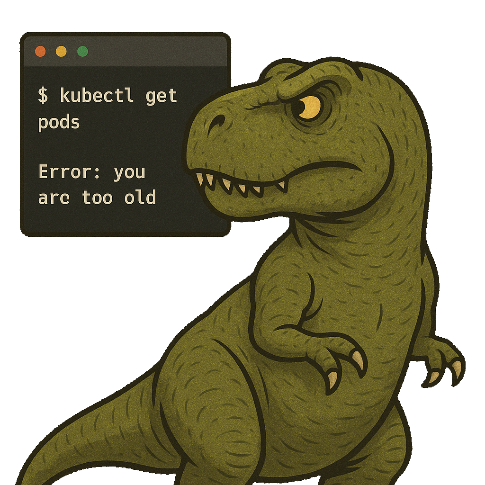

---
# Představení

## Administrátor & Vývojář v CESNET, z.s.p.o. --- 21 let</h2>
- eduroam, eduID, CESNET IdM + PKI

<div data-marpit-fragment>

## Platform Engineer v 3Key Company, s.r.o. --- od 11/2022

</div>

<div data-marpit-fragment>

## 3Key Company vyvíjí platformu [CZERTAINLY](https://www.czertainly.com/):
- Životní cyklus Digitálních Certifikátů
- Digitální podpisy dle eIDAS
- Open Source &  <ins>Cloud Native</ins>

</div>


---

# Vývoj sdílení prostředků
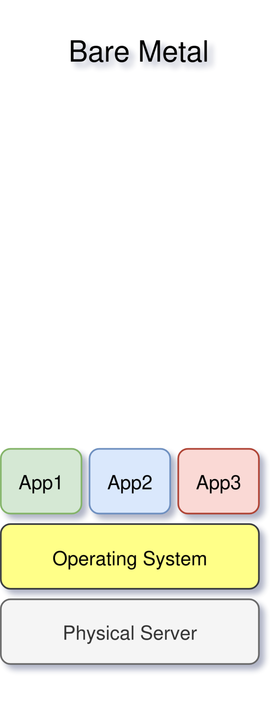

---

# Vývoj sdílení prostředků
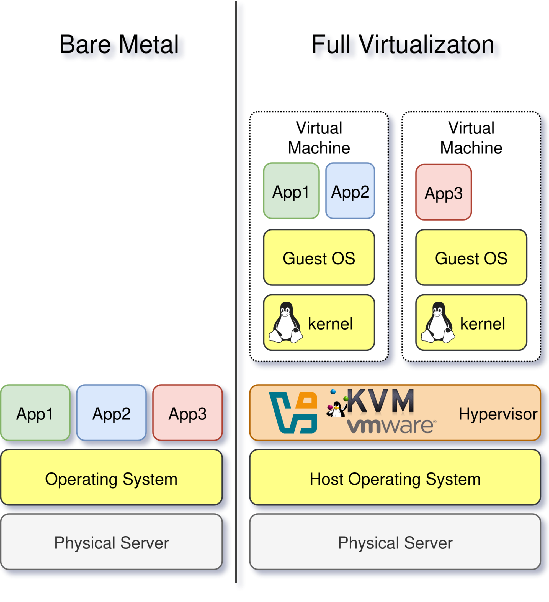

---

# Vývoj sdílení prostředků
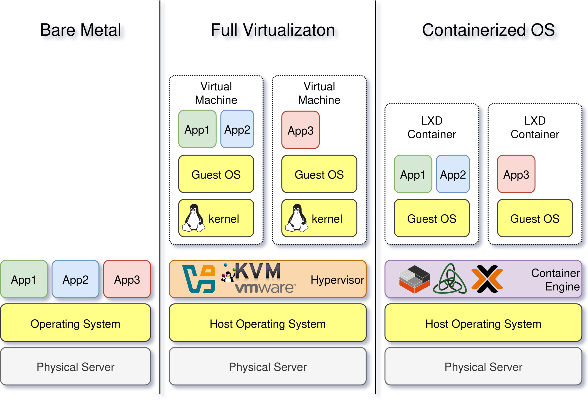

---

# Vývoj sdílení prostředků
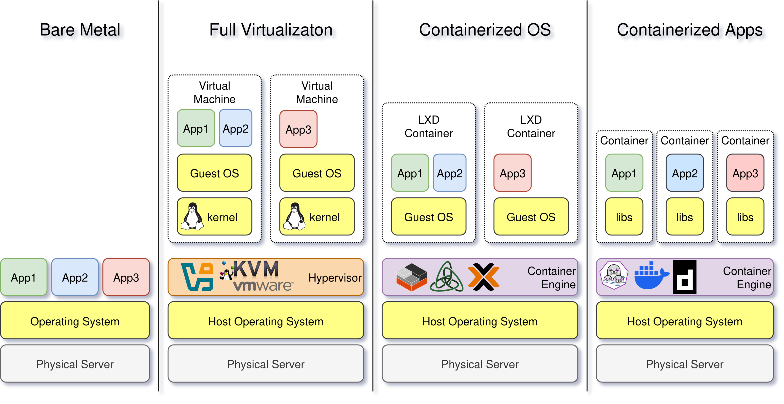

---
# Proč se zajímat o Kontejnery?
<div class="twocols">

## Obsahují
- **aplikaci**
* **aktuální** verzi aplikace
* závislosti = knihovny
&nbsp;
&nbsp;
&nbsp;

<p class="break"></p>

<div data-marpit-fragment>

## Neobsahují
* data
* konfiguraci
* kernel
* init systém
* ssh server, ...
</div>
</div>

---
# Kontejnery obsahují jen aplikaci

```
$ podman exec -it semik-nginx bash
root@7904f80d7a00:/# ps aux
USER         PID %CPU %MEM    VSZ   RSS TTY      STAT START   TIME COMMAND
root           1  0.0  0.0  14608  9096 ?        Ss   14:57   0:00 nginx: master process nginx -g daemon off;
www-data       2  0.0  0.0  14980  3588 ?        S    14:57   0:00 nginx: worker process
www-data       3  0.0  0.0  14980  3588 ?        S    14:57   0:00 nginx: worker process
www-data       4  0.0  0.0  14980  3588 ?        S    14:57   0:00 nginx: worker process
www-data       5  0.0  0.0  14980  3588 ?        S    14:57   0:00 nginx: worker process
www-data       6  0.0  0.0  14980  3588 ?        S    14:57   0:00 nginx: worker process
www-data       7  0.0  0.0  14980  3588 ?        S    14:57   0:00 nginx: worker process
www-data       8  0.0  0.0  14980  3588 ?        S    14:57   0:00 nginx: worker process
www-data       9  0.0  0.0  14980  3588 ?        S    14:57   0:00 nginx: worker process
www-data      10  0.0  0.0  14980  3588 ?        S    14:57   0:00 nginx: worker process
www-data      11  0.0  0.0  14980  3588 ?        S    14:57   0:00 nginx: worker process
www-data      12  0.0  0.0  14980  3588 ?        S    14:57   0:00 nginx: worker process
www-data      13  0.0  0.0  14980  3588 ?        S    14:57   0:00 nginx: worker process
www-data      14  0.0  0.0  14980  3588 ?        S    14:57   0:00 nginx: worker process
www-data      15  0.0  0.0  14980  3588 ?        S    14:57   0:00 nginx: worker process
www-data      16  0.0  0.0  14980  3588 ?        S    14:57   0:00 nginx: worker process
www-data      17  0.0  0.0  14980  3524 ?        S    14:57   0:00 nginx: worker process
root@7904f80d7a00:/# exit
```

---

# A proč se zajímat o Kubernetes?

* Nejrozšířenější orchestrátor kontejnerů
* Cloud Provideři
  - Amazon EKS (Elastic Kubernetes Service)
  - Google Kubernetes Engine (GKE)
  - Azure Kubernetes Service (AKS)
* On-Premise
  - OpenShift (RedHat)
  - RKE2 + Rancher (SUSE)
  - K3s (Lightweight Kubernetes)
* **Dokumentace** = předpis pro nasazení instalace aplikace


<!--
---
# Ukázka dokumentace instalace EJBCA

```yaml
ejbca:
  useEphemeralH2Database: false
  env:
    DATABASE_JDBC_URL: jdbc:postgresql://dbserver.3key.company:5432/ejbca
  env:
    - name: DATABASE_PASSWORD
      value: supertajne-heslo
    - name: DATABASE_USER
      value: ejbca-user

services:
  directHttp:
    enabled: true

ingress:
  enabled: true
  className: "nginx"
  annotations:
    cert-manager.io/cluster-issuer: letsencrypt-prod
    kubernetes.io/tls-acme: "true"
  hosts:
    - host: "ejbca.3key.company"
      paths:
        - path: /ejbca
          pathType: Prefix
  tls:
   - hosts:
       - ejbca.3key.company
     secretName: tls-secret
``` -->

---
# Znalosti potřebné pro Kubernetes

## 🥱 Síťové koncepty

<div data-marpit-fragment>

## 🥱 Základy Linuxu

</div>

<div data-marpit-fragment>

## 🏫 Kontejnery

</div>

<div data-marpit-fragment>

## 🤔 Základy YAML

</div>

<div data-marpit-fragment>

## ~~🥱 Základy verzovacích systémů~~

</div>

---

# Následující struktura přednášky
 - kontainer od samého začátku
 - kontainer s nginx serverem
 - kontainer s počítadlem návštěv
 - nasazení do Kubernetes

&nbsp;
&nbsp;
&nbsp;
&nbsp;


https://linuxdays2025.tomasek.cz/

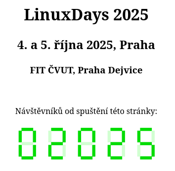

---

# Základní Debian kontainer - základ FS

```
$ sudo debootstrap --variant=minbase --arch=amd64 stable ./debian-rootfs http://deb.debian.org/debian/

[sudo] password for semik:
I: Target architecture can be executed
I: Retrieving InRelease
I: Checking Release signature
I: Valid Release signature (key id 41587F7DB8C774BCCF131416762F67A0B2C39DE4)
I: Retrieving Packages
I: Validating Packages
I: Resolving dependencies of required packages...
I: Resolving dependencies of base packages...
I: Checking component main on http://deb.debian.org/debian...
I: Retrieving apt 3.0.3
I: Validating apt 3.0.3
I: Retrieving base-files 13.8+deb13u1
...
I: Configuring libc-bin...
I: Unpacking the base system...
I: Base system installed successfully.

$ sudo tar -C ./debian-rootfs -czf debian-rootfs.tar.gz .
$ ls -lh debian-rootfs.tar.gz
-rw-r--r-- 1 semik semik 91M Sep 21 11:59 debian-rootfs.tar.gz
```

---
# Základní Debian kontainer - Dockerfile

```Dockerfile
FROM scratch
ADD debian-rootfs.tar.gz /
CMD ["/bin/bash"]
```

---
# Základní Debian kontainer - build
```
$ podman build -t semik-debian .
STEP 1/3: FROM scratch
STEP 2/3: ADD debian-rootfs.tar.gz /
--> 88a23cbc621
STEP 3/3: CMD ["/bin/bash"]
COMMIT semik-debian
--> 23e9c8d7323
Successfully tagged localhost/semik-debian:latest
23e9c8d7323dd1073c4dae198d259e39e93b4e09189ccc8f7aa359a8258f8e58
$ podman images | head -2
REPOSITORY              TAG    IMAGE ID      CREATED         SIZE
localhost/semik-debian  latest 23e9c8d7323d  11 seconds ago  307 MB
$ podman run -it --rm semik-debian
root@e51b231698ee:/# ps aux
USER         PID %CPU %MEM    VSZ   RSS TTY      STAT START   TIME COMMAND
root           1  0.0  0.0   4332  3868 pts/0    Ss   10:19   0:00 /bin/bash
root           2  0.0  0.0   6396  3864 pts/0    R+   10:19   0:00 ps aux
root@e51b231698ee:/# exit
$
```

---
# Přidání NGINX webserveru

```Dockerfile
FROM semik-debian

RUN apt-get update
RUN apt-get install -y nginx

CMD ["nginx", "-g", "daemon off;"]
```

---
# Přidání NGINX webserveru - build
```
$ podman build -t semik-nginx .
STEP 1/4: FROM semik-debian
STEP 2/4: RUN apt-get update
Hit:1 http://deb.debian.org/debian stable InRelease
...
--> 3e4e199c320
STEP 3/4: RUN apt-get install -y nginx
Reading package lists...
Building dependency tree...
...
--> 838947b502a
STEP 4/4: CMD ["nginx", "-g", "daemon off;"]
COMMIT semik-nginx
--> f8e6d41355a
Successfully tagged localhost/semik-nginx:latest
f8e6d41355a8987e18f83bbe88a615a89825561efd9a563bea0609e0cfbcbdeb
```
---
# Přidání NGINX webserveru - velikosti
```
$ podman images | head -2
REPOSITORY              TAG    IMAGE ID      CREATED         SIZE
localhost/semik-nginx   latest f8e6d41355a8  10 minutes ago  487 MB

$ podman history semik-nginx:latest
ID            CREATED        CREATED BY                              SIZE     COMMENT
838947b502a0  7 min ago      /bin/sh -c #(nop) CMD ["nginx", "-g", "dae...  0 B      FROM 838947b502a0
<missing>     7 min ago      /bin/sh -c apt-get install -y nginx            51.4 MB  FROM 3e4e199c3200
3e4e199c3200  7 min ago      /bin/sh -c apt-get update                      129 MB   FROM localhost/semik-debian
............................................................................^^^^^^..............................
8a93158a2a68  3 hours ago    /bin/sh -c #(nop) CMD ["/bin/bash"]            0 B      FROM 8a93158a2a68
<missing>     3 hours ago    /bin/sh -c #(nop) ADD file:9964643c2b482ae...  307 MB
```

---
# Přidání NGINX webserveru - optimalizace #1

```Dockerfile
FROM semik-debian

RUN apt-get update
RUN apt-get install -y nginx
RUN apt-get clean

CMD ["nginx", "-g", "daemon off;"]
```
---
# Přidání NGINX webserveru - optimalizace #1
```
$ podman images | head -2
REPOSITORY             TAG     IMAGE ID      CREATED         SIZE
localhost/semik-nginx  latest  63f05057b311  19 seconds ago  487 MB

$ podman history semik-nginx:latest
ID            CREATED         CREATED BY                                     SIZE        COMMENT
84ab1cf88f95  7 seconds ago   /bin/sh -c #(nop) CMD ["nginx", "-g", "dae...  0 B         FROM 84ab1cf88f95
<missing>     8 seconds ago   /bin/sh -c apt-get clean                       78.8 kB     FROM 838947b502a0
838947b502a0  20 minutes ago  /bin/sh -c apt-get install -y nginx            51.4 MB     FROM 3e4e199c3200
3e4e199c3200  20 minutes ago  /bin/sh -c apt-get update                      129 MB      FROM localhost/semik-debian
8a93158a2a68  4 hours ago     /bin/sh -c #(nop) CMD ["/bin/bash"]            0 B         FROM 8a93158a2a68
<missing>     4 hours ago     /bin/sh -c #(nop) ADD file:9964643c2b482ae...  307 MB
```

---
# Přidání NGINX webserveru  - optimalizace #2

```Dockerfile
FROM semik-debian

#RUN apt-get update
#RUN apt-get install -y nginx
#RUN apt-get clean
RUN apt-get update && apt-get install -y nginx && apt-get clean

CMD ["nginx", "-g", "daemon off;"]
```

<div data-marpit-fragment>

```
$ podman images | head -2
REPOSITORY             TAG     IMAGE ID      CREATED             SIZE
localhost/semik-nginx  latest  0498ab51a846  About a minute ago  346 MB

$ podman history semik-nginx:latest
ID            CREATED             CREATED BY                                     SIZE        COMMENT
b5b0bce5767a  About a minute ago  /bin/sh -c #(nop) CMD ["nginx", "-g", "dae...  0 B         FROM b5b0bce5767a
<missing>     About a minute ago  /bin/sh -c apt-get update && apt-get insta...  38.8 MB     FROM localhost/semik-debian
8a93158a2a68  4 hours ago         /bin/sh -c #(nop) CMD ["/bin/bash"]            0 B         FROM 8a93158a2a68
<missing>     4 hours ago         /bin/sh -c #(nop) ADD file:9964643c2b482ae...  307 MB
```

</div>

---

# Otestování NGINX image

```
$ podman run --rm -d --name semik-nginx -p 8080:80 semik-nginx
6246a4ca7d0e1e73b1bd9c3800a46ee98bcfb1d5c76a838bd9491c3d6ca67564
$
```

<div data-marpit-fragment>

```
$ podman ps
CONTAINER ID  IMAGE                         COMMAND               ...  PORTS                 NAMES
6246a4ca7d0e  localhost/semik-nginx:latest  nginx -g daemon o...  ...  0.0.0.0:8080->80/tcp  semik-nginx
$
```
</div>
<div data-marpit-fragment>


```
$ curl http://localhost:8080
<!DOCTYPE html>
<html>
<head>
<title>Welcome to nginx!</title>
...

```

</div>

---
# Zobrazení správné stránky
```
$ podman run --rm -d --name semik-nginx -p 8080:80 \
   -v $(pwd)/index.html:/var/www/html/index.nginx-debian.html:ro \
   semik-nginx
190e9adb47b71216c1e4729da78933f8cb9c0c3c4ecae5ad7bdb83b8578be5e7
```

<div data-marpit-fragment>

```
$ curl http://localhost:8080
<!DOCTYPE html>
<html><head><title>Vítejte na LinuxDays!</title></head>
<body style="text-align:center;">
<h1>LinuxDays 2025</h1>
<h2>4. a 5. října 2025, Praha</h2>
<h3>FIT ČVUT, Praha Dejvice</h3>
</body></html>
```
</div>
<div data-marpit-fragment>

```
$ podman stop semik-nginx
semik-nginx
$
```
</div>

---
# Vytvoření počítadla návštěv

## skript pro generován obrázků (bash + imagemagick)

```bash
./cgi-bin/7segment.sh -w 10 \
    -c '#00DD00' -o '#d2ffd2' \
    -b white 01234 output.png ; display output.png
```

<div data-marpit-fragment>

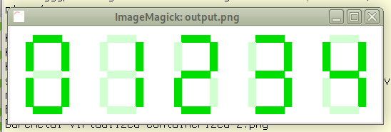

</div>

---
# Vytvoření počítadla návštěv - soubory

```
.
├── alive.txt
├── cgi-bin
│   ├── 7segment.sh
│   └── counter.sh
├── data
│   └── counter
├── Dockerfile
└── entrypoint.sh
```

`./data` - datový adresář pro počítadlo návštěv (mimo image)
`./cgi-bin/counter.sh` - skript počítadla návštěv

---

# Vytvoření počítadla návštěv - Dockerfile

```Dockerfile

FROM semik-debian

# Install busybox, bash, and any image dependencies (e.g., imagemagick, png tools, etc)
RUN apt-get update && apt-get install -y bash busybox imagemagick && apt-get clean

# Copy entrypoint script
COPY entrypoint.sh /

# Copy scripts
COPY cgi-bin/ /app/cgi-bin/
COPY alive.txt /app/

# Make CGI executable
RUN chmod +x /app/cgi-bin/*.sh /entrypoint.sh

# Start busybox httpd with CGI enabled
EXPOSE 8080

# CMD ["busybox", "httpd", "-vv", "-f", "-p", "8080", "-h", "/app"]
# bussybox httpd ignores TERM signal, so we need a wrapper script to handle shutdown faster
CMD [ "/entrypoint.sh" ]
```
---

# Vytvoření počítadla návštěv - test

```
$ podman run --rm --name semik-counter \
  -p 8080:8080 \
  -v $(pwd)/data:/data -e COUNTER_DIR=/data semik-counter
[::ffff:10.0.2.100]:48136: url:/cgi-bin/counter.sh
[::ffff:10.0.2.100]:48142: url:/cgi-bin/counter.sh
[::ffff:10.0.2.100]:48150: url:/cgi-bin/counter.sh
[::ffff:10.0.2.100]:48158: url:/cgi-bin/counter.sh
```

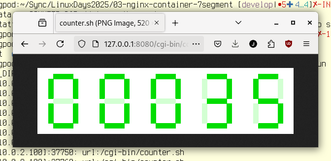

---
# Takhle ne! :)

- před-připravené image
* hub.docker.com
  - oficiální verze od autorů software
  - uživatelské verze
  - https://docs.docker.com/docker-hub/usage/
* bitnami
&nbsp;
&nbsp;
<div data-marpit-fragment>

```
$ podman images  | grep library\/nginx\\\|semik75/ld25-nginx
localhost/semik75/ld25-nginx   latest             0f252a932576  5 days ago     346 MB
docker.io/library/nginx        latest             203ad09fc156  7 weeks ago    197 MB
```
</div>

---
# YAML Ain't Markup Language

- čitelnost nejen strojem, ale i člověkem
* struktura a hierarchie dat je řešena odsazením (**mezerami**, ne tabulátory)
* neomezené úrovně vnořování
* nahrazuje *složité* JSON konfigurace
  * XML si pamatují už jen 🦖
* používá se k definici objektů v Kubernetes

---
# Základní struktura YAML

```yaml
jmeno: "Ukázka struktury YAML"
verze: 1.0
cesky: true
cislo: 42
pole:
  - polozka1
  - polozka2
hash:
  klic1: hodnota1
  klic2: "hodnota 2"
dataTakJakJsou: |
  Toto je text,
  ve kterém budou zachovány
  nové řádky.
dataVJednomRadku: >
  Toto je text,
  který bude interpretován jako
  jediný řádek.
```

---
# Příklad YAML manifestu pro Kubernetes

```yaml
apiVersion: v1
kind: Pod
metadata:
  name: nginx-static
spec:
  containers:
  - image: docker.io/semik75/ld25-nginx:latest
    name: nginx-static
    ports:
    - containerPort: 8080
    volumeMounts:
      - name: config
        mountPath: /var/www/html/index.html
        subPath: index.html
  volumes:
  - name: config
    configMap:
      name: nginx-static
```

---
# Nahrání obrazů kontenerů do Artefact Registry

```
$ podman login docker.io
Username: semik75
Password:
Login Succeeded!
$ podman tag semik-nginx semik75/ld25-nginx:latest
$ podman tag semik-counter semik75/ld25-counter:latest
$
$ podman push semik75/ld25-nginx:latest
Getting image source signatures
Copying blob 8cd8bb154730 done
Copying blob e91d164cdb11 done
Copying config 0f252a9325 done
Writing manifest to image destination
Storing signatures
$
$ podman push semik75/ld25-counter:latest
Getting image source signatures
Copying blob 3c2da93b9307 done
...
Copying blob 469a5aa7e0e2 skipped: already exists
Copying config 917795cd2e done
Writing manifest to image destination
Storing signatures
$
```
---
# kubectl - Kubernetes CLI

```bash
$ export KUBECONFIG=${HOME}/Sync/config/kube-config-lab10
$ kubectl config set-context --current --namespace linuxdays2025
Context "default" modified.
$ kubectl get pods
NAME                           READY   STATUS    RESTARTS   AGE
cgi-counter-7dd7c9998f-7pl6n   1/1     Running   0          16h
cgi-counter-7dd7c9998f-bslbc   1/1     Running   0          16h
cgi-counter-7dd7c9998f-xm95g   1/1     Running   0          16h
nginx-static-d7cb778c4-hmkxv   1/1     Running   0          16h                             #
```
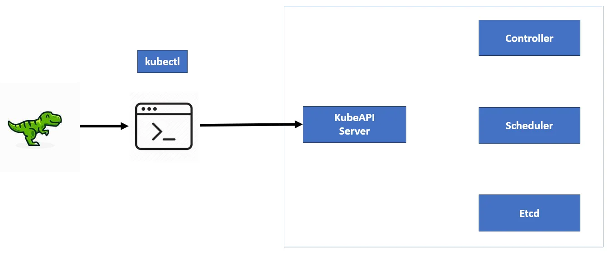
<!-- image from https://medium.com/@sanoj.sudo/how-kubectl-works-and-communicates-with-the-kubernetes-api-server-and-pod-creation-journey-f5fce5ff8323> -->

---
# kubectl - config

```
$ cat $KUBECONFIG
apiVersion: v1
clusters:
- cluster:
    certificate-authority-data: LS0tLS1CR...
    server: https://46.62.xxx.yyy:6443
  name: default
contexts:
- context:
    cluster: default
    namespace: linuxdays2025
    user: default
  name: default
current-context: default
kind: Config
preferences: {}
users:
- name: default
  user:
    client-certificate-data: LS0tLS1CR...
    client-key-data: LS0tLS1CR...
```

---
# První nasazení do Kubernetes

```
$ kubectl run nginx-static --image=docker.io/semik75/ld25-nginx:latest \
  --restart=Never --port=8080
pod/nginx-static created
$ kubectl get pods -o wide
NAME          READY   STATUS    RESTARTS   AGE     IP           NODE
nginx-static  1/1     Running   0           5s     10.42.0.65   lab10
```

<div data-marpit-fragment>

```
$ kubectl port-forward nginx-static 8080:80 &
Forwarding from 127.0.0.1:8080 -> 80
Forwarding from [::1]:8080 -> 80
[1] 2474495
```
</div>
<div data-marpit-fragment>

```
$ curl http://localhost:8080
Handling connection for 8080
<html><head>
<title>Welcome to nginx!</title>
...
```
</div>

---

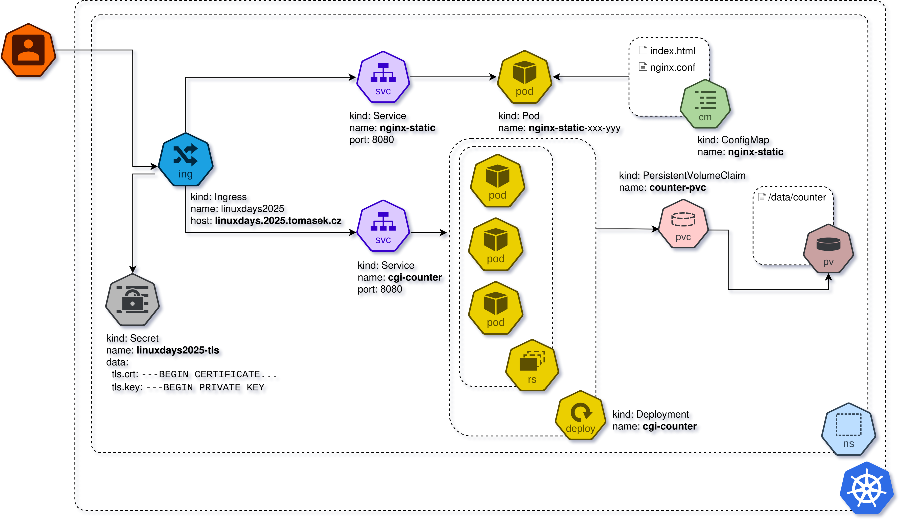


---

# ConfigMap #1 - declarative

```yaml
apiVersion: v1
kind: ConfigMap
metadata:
  name: nginx-static
data:
  index.html: |
    ...
    <h1>LinuxDays 2025</h1>
    ...
    <p>Návštěvníků od spuštění této stránky:</p>
    ...
    </body></html>
  nginx.conf: |
    error_log /dev/stdout info;
    events {
      worker_connections  1024;
    }
    http {
      access_log    /dev/stdout;

      server {
        listen       8080;
        server_name  localhost;

      ...
```
---
# ConfigMap #2 - imperative

```bash
$ kubectl create configmap nginx-static \
    --from-file=index.html=/path/to/index.html \
    --from-file=nginx.conf=/path/to/nginx.conf                                               #
```

```bash
$ kubectl create configmap nginx-static \
    --from-file=index.html=/path/to/index.html \
    --from-file=nginx.conf=/path/to/nginx.conf --dry-run=client -o yaml > nginx-configmap.yaml
```
---
# Secret

```yaml
apiVersion: v1
kind: Secret
metadata:
  name: linuxdays2025-tls
data:
  tls.crt: LS0t...
  tls.key: LS0t...
```

```
$ kubectl create secret generic linuxdays2025-tls \
    --from-file=tls.crt=/path/to/tls.crt \
    --from-file=tls.key=/path/to/tls.key
```

---
# ConfigMap vs Secret

<div class="twocols">

- konfigurační soubory
- etcd (nešifrovaně)
- prostý text
- RBAC

<p class="break"></p>
<div data-marpit-fragment>

- hesla, tokeny, certifikáty
- etcd (volitelné šifrování)
- base64
- striktnější RBAC
</div>
</div>

---
# PersistentVolumeClaim

```yaml
apiVersion: v1
kind: PersistentVolumeClaim
metadata:
  name: counter-pvc
spec:
  accessModes:
    - ReadWriteOnce
  # storageClassName: local-path
  resources:
    requests:
      storage: 1Mi
```

---

# PersistentVolume (PV) vs PersistentVolumeClaim (PVC)

<div class="twocols">

- abstrakce úložiště
- žije nezávisle na PODech
- různé typy úložišť (NFS, iSCSI, cloudové služby, lokální disky, ...)
- recyklace podle politiky
  - Retain
  - Recycle
  - Delete

<p class="break"></p>

<div data-marpit-fragment>

- žádost úložiště
- dynamické přidělení
- přístupové režimy
  - ReadWriteOnce
  - ReadOnlyMany
  - ReadWriteMany

&nbsp;
</div>
</div>

---
#  POD vs ~~ReplicaSet~~ vs Deployment

<div class="twocols">

- nejmenší spusitelná jednotka
- obsahuje jeden nebo více kontejnerů
- dočasný - "smrtelný" objekt
- závislý na Node umírá s ním
- nevhodný pro přímé nasazení
&nbsp;
<p class="break"></p>

<div data-marpit-fragment>

- vyšší abstrakce nad PODy
- má na starosti aby požadovaný počet replik PODů
- standardní způsob nasazení v produkci

&nbsp;
</div>
</div>

---
# Deployment nginx

```yaml
apiVersion: apps/v1
kind: Pod
metadata:
  name: nginx-static-xxx-yyy
  labels:
    app: nginx-static
spec:
  containers:
  - name: nginx
    image: docker.io/semik75/ld25-nginx:latest
    imagePullPolicy: Always
    ports:
    - containerPort: 8080
    volumeMounts:
    - name: config
      mountPath: /var/www/html/index.html
      subPath: index.html
    - name: config
      mountPath: /etc/nginx/nginx.conf
      subPath: nginx.conf
  volumes:
  - name: config
    configMap:
      name: nginx-static
```

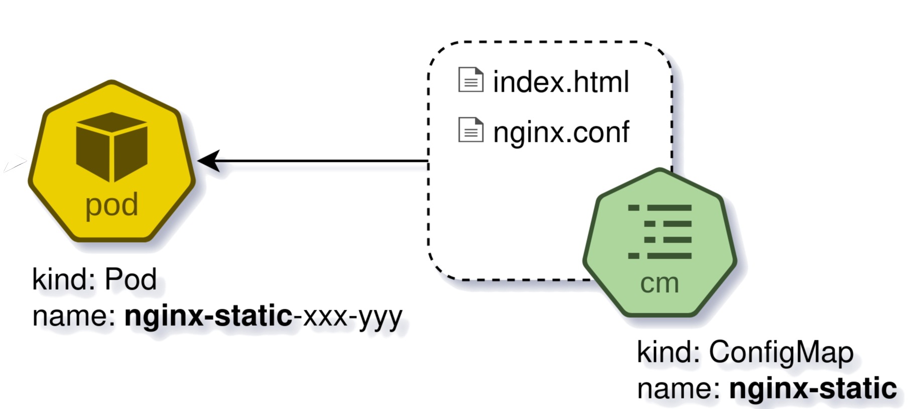

---
# Deployment counter

```yaml
apiVersion: apps/v1
kind: Deployment
metadata:
  name: cgi-counter
spec:
  replicas: 3
  selector:
    matchLabels:
      app: cgi-counter
  template:
    metadata:
      labels:
        app: cgi-counter
    spec:
      containers:
      - name: cgi-counter
        image: docker.io/semik75/ld25-counter:latest
        imagePullPolicy: Always
        ports:
        - containerPort: 8080
        env:
        - name: COUNTER_DIR
          value: /data
        volumeMounts:
        - name: data
          mountPath: /data
      volumes:
      - name: data
        persistentVolumeClaim:
          claimName: counter-pvc
```

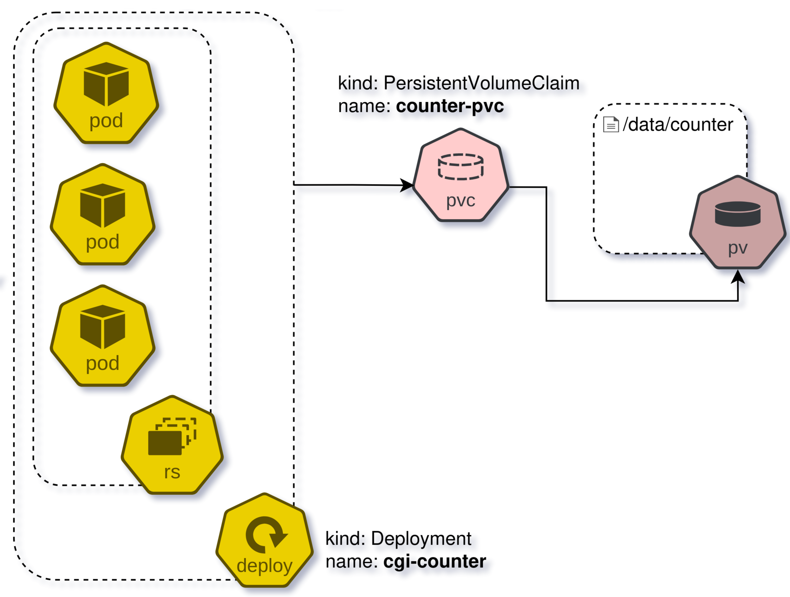

---

# Service


<div class="twocols">

```yaml
apiVersion: v1
kind: Service
metadata:
  name: nginx-static
spec:
  type: ClusterIP
  selector:
    app: nginx-static
  ports:
  - protocol: TCP
    port: 8080
    targetPort: 8080
```

<p class="break"></p>

<div data-marpit-fragment>

```yaml
apiVersion: v1
kind: Service
metadata:
  name: cgi-counter
spec:
  type: NodePort
  selector:
    app: cgi-counter
  ports:
  - protocol: TCP
    port: 8080
    targetPort: 8080
    nodePort: 32025
```
</div>
</div>

---

# Service - type: NodePort

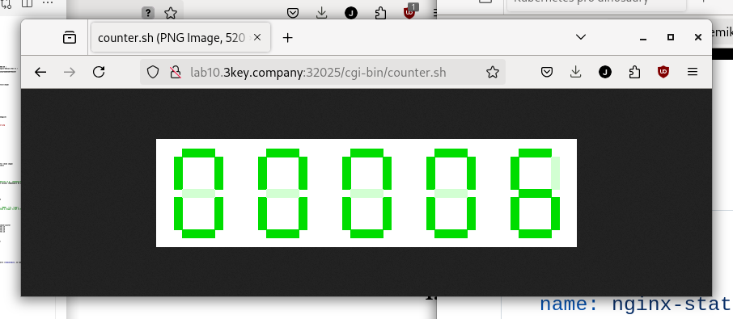

---

# Ingress

```yaml
apiVersion: networking.k8s.io/v1
kind: Ingress
metadata:
  name: linuxdays2025
  annotations:
    kubernetes.io/ingress.class: "nginx"
    cert-manager.io/cluster-issuer: "letsencrypt-prod"
spec:
  tls:
  - hosts:
    - linuxdays2025.tomasek.cz
    secretName: linuxdays2025-tls
  rules:
  - host: linuxdays2025.tomasek.cz
    http:
      paths:
      - path: /
        pathType: Prefix
        backend:
          service:
            name: nginx-static
            port:
              number: 8080
      - path: /cgi-bin/counter.sh
        pathType: ImplementationSpecific
        backend:
          service:
            name: cgi-counter
            port:
              number: 8080
```

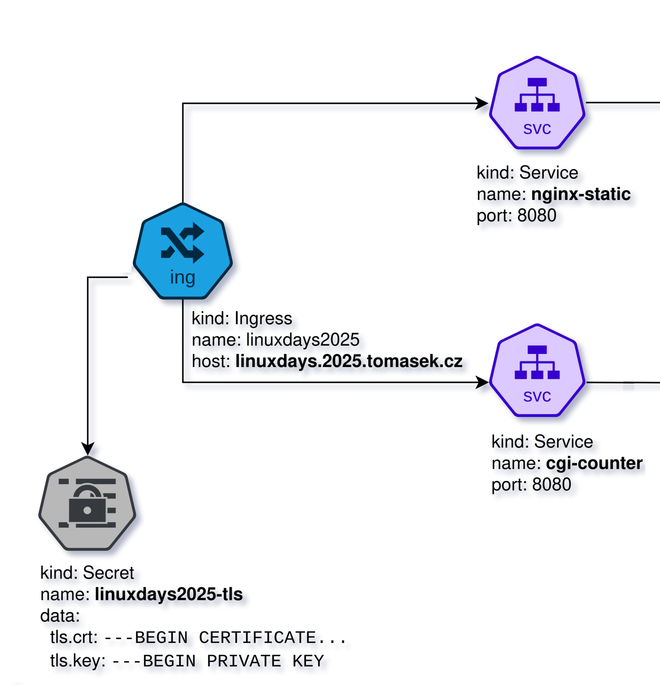

---


---

# Nasazení všech objektů

```
$ ls -1
counter-pvc.yaml
counter-deployment.yaml
counter-service.yaml
linuxdays2025-ingress.yaml
nginx-configmap.yaml
nginx-deployment.yaml
nginx-service.yaml
```
<div data-marpit-fragment>

```
$ for i in *.yaml ; do kubectl apply -f "$i" ; done
deployment.apps/cgi-counter created
persistentvolumeclaim/counter-pvc created
service/cgi-counter created
ingress.networking.k8s.io/linuxdays2025 created
ingress.networking.k8s.io/linuxdays2025-alive created
configmap/nginx-static created
deployment.apps/nginx-static created
service/nginx-static created
```

</div>

---

# Zobrazení nasazených objektů

```
$ kubectl get all,configmap,pvc,ingress
NAME                               READY   STATUS    RESTARTS   AGE
pod/cgi-counter-7dd7c9998f-7pl6n   1/1     Running   0          3m43s
pod/cgi-counter-7dd7c9998f-bslbc   1/1     Running   0          3m43s
pod/cgi-counter-7dd7c9998f-xm95g   1/1     Running   0          3m43s
pod/nginx-static-d7cb778c4-hmkxv   1/1     Running   0          3m41s

NAME                   TYPE        CLUSTER-IP     EXTERNAL-IP   PORT(S)          AGE
service/cgi-counter    NodePort    10.43.5.65     <none>        8080:32025/TCP   3m43s
service/nginx-static   ClusterIP   10.43.49.102   <none>        8080/TCP         3m41s

NAME                           READY   UP-TO-DATE   AVAILABLE   AGE
deployment.apps/cgi-counter    3/3     3            3           3m44s
deployment.apps/nginx-static   1/1     1            1           3m42s

NAME                                     DESIRED   CURRENT   READY   AGE
replicaset.apps/cgi-counter-7dd7c9998f   3         3         3       3m44s
replicaset.apps/nginx-static-d7cb778c4   1         1         1       3m42s

NAME                         DATA   AGE
configmap/kube-root-ca.crt   1      5d
configmap/nginx-static       2      3m42s

NAME                       TYPE                DATA   AGE
secret/linuxdays2025-tls   kubernetes.io/tls   2      4d10h

NAME                                STATUS   VOLUME             CAPACITY   ACCESS MODES   STORAGECLASS
persistentvolumeclaim/counter-pvc   Bound    pvc-1a02c453...    1Mi        RWO            local-path

NAME                          CLASS   HOSTS                      ADDRESS         PORTS     AGE
ingress/linuxdays2025         nginx   linuxdays2025.tomasek.cz   46.62.206.246   80, 443   3m43s
```
---
# Detaily o deployment.apps/cgi-counter
```
$ kubectl describe deployment.apps/cgi-counter
Name:                   cgi-counter
Namespace:              linuxdays2025
CreationTimestamp:      Thu, 02 Oct 2025 19:26:20 +0200
Replicas:               3 desired | 3 updated | 3 total | 3 available | 0 unavailable
StrategyType:           RollingUpdate
RollingUpdateStrategy:  25% max unavailable, 25% max surge
Pod Template:
  Containers:
   cgi-counter:
    Image:      docker.io/semik75/ld25-counter:latest
    Port:       8080/TCP
    Environment:
      COUNTER_DIR:  /data
    Mounts:
      /data from data (rw)
  Volumes:
   data:
    Type:          PersistentVolumeClaim (a reference to a PersistentVolumeClaim in the same namespace)
    ClaimName:     counter-pvc
    ReadOnly:      false
Conditions:
NewReplicaSet:   cgi-counter-7dd7c9998f (3/3 replicas created)
Events:
  Type    Reason             Age   From                   Message
  ----    ------             ----  ----                   -------
  Normal  ScalingReplicaSet  9m8s  deployment-controller  Scaled up replica set cgi-counter-7dd7c9998f from 0 to 3
```

---
# Interaktivní shell v kontejneru

```
$ kubectl exec cgi-counter-7dd7c9998f-7pl6n -it -- bash
root@cgi-counter-7dd7c9998f-7pl6n:/# cd /data/
root@cgi-counter-7dd7c9998f-7pl6n:/data# cat counter
00004
```

<div data-marpit-fragment>

```
$ kubectl -n kube-system exec pod/etcd-lab10 -it -- sh
error: Internal error occurred: Internal error occurred: error executing command
in container: failed to exec in container: failed to start exec
"128c5ae737916eb778b82feadb6b6cd66c545c83d0b3f667a2e02492a4166c4c": OCI runtime
exec failed: exec failed: unable to start container process: exec: "sh": executable
file not found in $PATH

```
</div>

---

<!-- # Architektura Kubernetes -->


<!-- image from https://kubernetes.io/docs/concepts/architecture/ -->

---
# Logging

- každý contejner má svůj stdout/stderr
* logy jsou dočasné - žijí s PODem
* `kubectl logs <pod-name> [-c <container-name>] [--previous]`
* logovací agenti (Filebeat+Logstash, …) sbírají logy a odesílají je do centrálního úložiště
* formáty: text, JSON
* centrální úložiště: Elasticsearch, …

<div data-marpit-fragment>

```
$ kubectl logs nginx-static-d7cb778c4-hmkxv --tail 5
10.42.0.106 - - [02/Oct/2025:22:31:50 +0000] "GET / HTTP/1.1" 200 506 "-" "-"
2025/10/02 22:32:50 [info] 7#7: *6 client 10.42.0.106 closed keepalive connection
10.42.0.106 - - [03/Oct/2025:10:26:50 +0000] "GET / HTTP/1.1" 304 0 "-" "Mozilla/5.0 (X11; Linux x86_64; rv:128.0) Gecko/20100101 Firefox/128.0"
10.42.0.106 - - [03/Oct/2025:10:26:53 +0000] "GET / HTTP/1.1" 304 0 "-" "Mozilla/5.0 (X11; Linux x86_64; rv:128.0) Gecko/20100101 Firefox/128.0"
10.42.0.106 - - [03/Oct/2025:10:26:54 +0000] "GET / HTTP/1.1" 304 0 "-" "Mozilla/5.0 (X11; Linux x86_64; rv:128.0) Gecko/20100101 Firefox/128.0"
```
</div>

---
# Jak zjistit, že něco negunguje?
```
$ kubectl -A get events
NAMESPACE   LAST SEEN                TYPE      REASON      OBJECT                                      MESSAGE
ejbcace     38m (x1232 over 14d)     Normal    Started     Pod/ejbca-...   Started container ejbca-community-helm
ejbcace     3m59s (x1234 over 14d)   Normal    Killing     Pod/ejbca-...   Container ejbca-community-helm failed startup probe, will be restarted
ejbcace     3m29s (x1234 over 14d)   Normal    Pulled      Pod/ejbca-...   Container image "keyfactor/ejbca-ce:8.2.0.1" already present on machine
ejbcace     3m29s (x1234 over 14d)   Normal    Created     Pod/ejbca-...   Created container: ejbca-community-helm
ejbcace     1s (x617097 over 14d)    Warning   Unhealthy   Pod/ejbca-...   Startup probe failed: dial tcp 10.42.0.119:8443: connect: connection refused
$
$ kubectl -n ejbcace get pods
NAME                                    READY   STATUS    RESTARTS           AGE
ejbca-community-helm-76fc567d4d-nkfqd   0/1     Running   1816 (9m17s ago)   32d

```

<div data-marpit-fragment>

# A proč nefunguje?
```
$ kubectl -n ejbcace logs pod/ejbca-community-helm-76fc567d4d-nkfqd --tail 5
2025-10-03 10:41:37,572+0000 INFO  [org.apache.commons.beanutils.FluentPropertyBeanIntrospector] (main) Error when creating ...
2025-10-03 10:41:38,000+0000 ERROR [org.ejbca.ui.cli.jdbc.JdbcTool] (main) FATAL: password authentication failed for user "ejbcace"
2025-10-03 10:41:38,000+0000 INFO  [org.ejbca.ui.cli.jdbc.JdbcTool] (main) Done.
2025-10-03 10:41:38,030+0000 INFO  [/start.sh] (process:1) Waiting for database 'jdbc:postgresql://.../ejbcace' to become available.
```
</div>

---
# Co dělat, když něco nestartuje?

```
$ kubectl get pods
NAME                                READY   STATUS        RESTARTS       AGE
qes-nginx-ingress-9589b89b5-rmngv   2/2     Running       1 (143m ago)   144m
signserver-66d7bbb74f-hw5bv         0/6     Pending       0              50s

$ kubectl describe pod signserver-66d7bbb74f-hw5bv
Events:
  Type     Reason            Age   From                   Message
  ----     ------            ----  ----                   -------
  Warning  FailedScheduling  25s   gke.io/opt-util-sched  0/8 nodes are available: 8 Insufficient cpu,
                                                          8 Insufficient memory.
                                                          preemption: 0/8 nodes are available: 8
                                                          No preemption victims found for incoming pod.
  Normal   TriggeredScaleUp  23s   cluster-autoscaler     Pod triggered scale-up: [{https://www.googleapis.com...}]
```

<!-- ---

# k9s - terminal UI pro Kubernetes

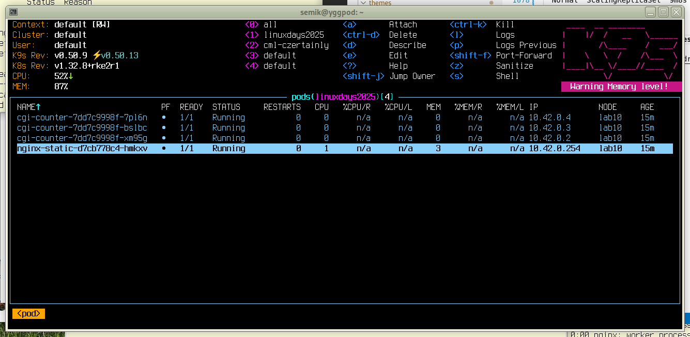 -->

---

# Jak dál?

- Kurz: [Certified Kubernetes Administrator (CKA) with Practice Tests](https://www.udemy.com/course/certified-kubernetes-administrator-with-practice-tests) od Mumshad Mannambeth na [Udemy](https://www.udemy.com/)
* Vlastní Kubernetes:
  - [minikube](https://minikube.sigs.k8s.io/docs/) - ve virtuálu
  - [Talos Linux](https://talos.dev/) - na fyzickém HW nebo VM
  - [RKE2](https://docs.rke2.io/) - klasický Linux na fyzickém HW nebo VM
  - [CZERTAINLY Appliance](https://docs.czertainly.com/docs/certificate-key/installation-guide/deployment/deployment-appliance/initialization), viz [přednáška na LinuxDays 2023](https://pretalx.linuxdays.cz/linuxdays-2023/talk/F37GKW/)
* Cloudové Kubernetes
  - OpenShift - [na 30d znovu a znovu](https://console.redhat.com/openshift/sandbox)
* [Helm]() - package manager pro Kubernetes

---
# Otázky?

Jan Tomášek <jan@tomasek.cz>

https://tomasek.cz/ld25

https://github.com/semik/LinuxDays2025

https://linuxdays2025.tomasek.cz/

<div data-marpit-fragment>
&nbsp;
&nbsp;
&nbsp;
&nbsp;
&nbsp;

## Děkuji za příležitost přednášet na LinuxDays 2025.

</div>